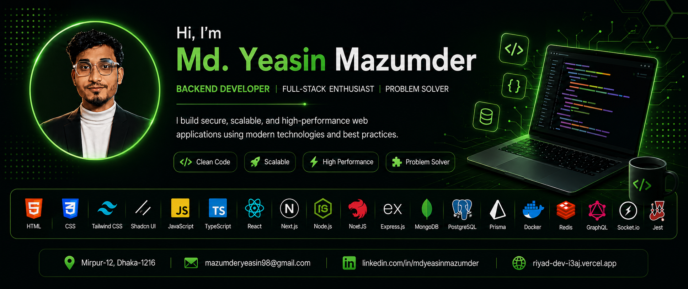

<!-- ========================= -->
<!--        BANNER             -->
<!-- ========================= -->

  

<h1 align="center">
Hi 👋, I'm Md. Yeasin Mazumder
</h1>

<h3 align="center">
🚀 Backend Developer | Full-Stack Enthusiast | Problem Solver
</h3>

I build secure, scalable and production-ready web applications using modern technologies and best engineering practices.

---

## 👨‍💻 About Me

> Passionate about transforming ideas into **secure**, **scalable**, and **high-performance** web applications.

- 💼 **Role:** Backend Developer
- 🌍 **Location:** Mirpur-12, Dhaka, Bangladesh
- 💻 **Specialization:** Node.js, NestJS, Express.js & TypeScript
- 🛠️ **Experienced With:** PostgreSQL, MongoDB, Prisma, Docker, Redis & GraphQL
- 🚀 **Currently Learning:** AWS, Microservices, DevOps & System Design
- 🎯 **Goal:** Build software that is clean, maintainable, and scalable.

---

# 🚀 Tech Stack

### 🎨 Frontend

---

### ⚙️ Backend

---

### 🗄️ Database & ORM

- ⚡ Drizzle ORM

---

### 🧠 Programming Languages

---

### ☁️ DevOps & Tools

- Swagger
- Socket.io
- Shadcn UI

---

# 💼 What I Do

✅ REST APIs

✅ Authentication & Authorization

✅ JWT & OAuth

✅ Database Design

✅ Clean Architecture

✅ MVC Pattern

✅ API Documentation

✅ Backend Performance Optimization

✅ Real-time Applications

✅ Scalable Backend Systems

---

# 🎯 Current Focus

- 🔥 NestJS
- 🚀 Next.js
- ⚡ System Design
- ☁️ Cloud Deployment
- 🐳 Docker
- 🔴 Redis
- 🏗️ Scalable Backend Architecture

---

# 📈 GitHub Stats

---

# 🛠 Favorite Technologies

---

# 🌎 Let's Connect!

I'm always open to collaborating on interesting projects, contributing to open source, and connecting with fellow developers.

📍 **Location**

Mirpur-12, Dhaka-1216

📧 **Email**

**mazumderyeasin98@gmail.com**

🌐 **Portfolio**

https://riyad-dev-i3aj.vercel.app/

💼 **LinkedIn**

https://www.linkedin.com/in/mdyeasinmazumder

---

# 💙 Thanks for visiting!

⭐ From **Md. Yeasin Mazumder**

